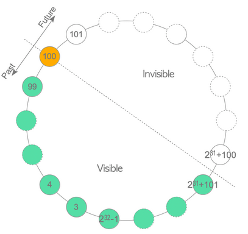

# PostgreSQL VACUUM 之深入浅出

# 前言

VACUUM  是 PostgreSQL MVCC (Multiversion concurrency control) 实现的核心机制之一，是 PostgreSQL 正常运行的重要保证。本文将通过实例演示 PostgreSQL 为什么需要做 VACUUM，以及一步一步精准触发 AUTOVACUUM， 到 VACUUM 优化实战，深入浅出，一看就懂。

# 测试环境准备

以下测试是在 PostgreSQL 11 中进行。

通过以下 SQL 创建：

测试用户: alvin，普通用户，非 superuser

测试数据库: alvindb，owner 是 alvin

测试 schema: alvin，owner 也是 alvin

这里采用的是 user 与 schema 同名，结合默认的 search_path("$user", public)，这样操作对象(table, sequence, etc.)时就不需要加 schema 前缀了。

```
postgres=# CREATE USER alvin WITH PASSWORD 'alvin';
CREATE ROLE
postgres=# CREATE DATABASE alvindb OWNER alvin;
CREATE DATABASE
postgres=# \c alvindb
You are now connected to database "alvindb" as user "postgres".
alvindb=# CREATE SCHEMA alvin AUTHORIZATION alvin;
CREATE SCHEMA
alvindb=# \c alvindb alvin
You are now connected to database "alvindb" as user "alvin".
alvindb=> SHOW search_path;
   search_path   
-----------------
 "$user", public
(1 row)
```

# PostgreSQL 为什么需要做 VACUUM

这要从 PostgreSQL MVCC UPDATE/DELETE 实现讲起。

下面通过简单演示 PostgreSQL 中 UPDATE/DELETE 时底层数据变化，揭秘其 MVCC 设计的艺术。

为了方便看其底层数据，通过 superuser postgres 创建 extension pageinspect:

```
$ psql -d alvindb -U postgres
alvindb=# CREATE EXTENSION IF NOT EXISTS pageinspect;
CREATE EXTENSION
alvindb=# \dx pageinspect
                              List of installed extensions
    Name     | Version | Schema |                      Description                      
-------------+---------+--------+-------------------------------------------------------
 pageinspect | 1.7     | public | inspect the contents of database pages at a low level
(1 row)
```

首先，创建测试表

```
$ psql -d alvindb -U alvin
alvindb=> 
CREATE TABLE tb_test_vacuum (
    test_id BIGSERIAL PRIMARY KEY,
    test_num BIGINT
);
CREATE TABLE
```

插入 3 条测试数据

```
alvindb=> INSERT INTO tb_test_vacuum(test_num) SELECT gid FROM generate_series(1,3,1) gid;
INSERT 0 3
alvindb=> SELECT * FROM tb_test_vacuum ORDER BY 1 DESC LIMIT 5;
 test_id | test_num 
---------+----------
       3 |        3
       2 |        2
       1 |        1
(3 rows)
```

查看其底层数据。

```
alvindb=> SELECT * FROM heap_page_items(get_raw_page('alvin.tb_test_vacuum', 0)) LIMIT 10;
ERROR:  must be superuser to use raw functions
```

可以看到底层数据只有 superuser 才可以查看，**这里另打开一个窗口，用 superuser 用户 postgres 查看**。

```
psql -d alvindb -U postgres
alvindb=# SELECT * FROM heap_page_items(get_raw_page('alvin.tb_test_vacuum', 0)) LIMIT 10;
```


这里 `t_xmin` 为其插入时 transaction id。

下面删除 2 条数据:

```
alvindb=> DELETE FROM tb_test_vacuum WHERE test_id = 2;
DELETE 1
alvindb=> DELETE FROM tb_test_vacuum WHERE test_id = 3;
DELETE 1
alvindb=> SELECT * FROM tb_test_vacuum ORDER BY 1 DESC LIMIT 5;
 test_id | test_num 
---------+----------
       1 |        1
(1 row)
```

此时在第二个窗口再看其底层数据

```
alvindb=> SELECT * FROM heap_page_items(get_raw_page('alvin.tb_test_vacuum', 0)) LIMIT 10;
```


这时你会发现，实际数据并未被删除。只是修改了 `t_xmax`，`t_infomask2` 和 `t_infomask`。`t_xmax` 为删除时的 transaction id，`t_infomask2` 和 `t_infomask` 为各种标志位，这里显示的是其二进制转换后的十进制。

**为什么不直接物理删除数据呢？**

主要是出于以下考虑:

这些被删除的数据可能还在被其他事务访问，所以不能直接删除。这就是所谓的 MVCC 中的 multi version，即多版本，不同事务访问的可能是不同版本的数据。transaction id 可以理解为版本号。其他事务可能还在访问 `t_xmax` 为 15400741 或 15400742 的数据。

**为什么有的其他数据库 MVCC 实现底层数据就不是这样呢？**

Oracle 中将要删除数据转移到了 UNDO tablespace 中，供其他事务访问，以实现 MVCC。

**PostgreSQL 为什么这么实现呢？**

大家可以想一下，“转移数据” 与 “改标志位”，哪个 cost 高呢？当然是 “改标志位” 既简单又高效了！可见 PostgreSQL 设计之巧妙。

**另外，PostgreSQL 这样做还有一个好处。**

Oracle DBA 都非常熟悉 ORA-01555: snapshot too old，其原因是 UNDO tablespace 大小毕竟是有限的，存储的老版本数据也是有限的，Oracle 中解决 snapshot too old 一个办法就是增大 UNDO tablespace。PostgreSQL 中这样保留老版本数据，可以说磁盘有多大，“UNDO tablespace” 就有多大，就不会出现类似 snapshot too old 这样的问题。

**但凡事都有两面性。**

**PostgreSQL 中这样保留老版本数据有什么弊端呢？**

老版本的数据是可能有其他事务需要访问，但随着时间的推移，这些事务终将结束，对应老版本的数据终将不被需要，它们将不断占用甚至耗尽磁盘空间，使数据访问变得很慢，这就是 PostgreSQL 中的 Bloat ，即膨胀。

 **PostgreSQL 中的 bloat 问题如何解决呢？**

就是 VACUUM。可以理解为“回收空间”。

现在对表 `alvin.tb_test_vacuum` 进行 VACUUM 操作。

```
alvindb=> VACUUM VERBOSE tb_test_vacuum;
INFO:  vacuuming "alvin.tb_test_vacuum"
INFO:  scanned index "tb_test_vacuum_pkey" to remove 2 row versions
DETAIL:  CPU: user: 0.00 s, system: 0.00 s, elapsed: 0.00 s
INFO:  "tb_test_vacuum": removed 2 row versions in 1 pages
DETAIL:  CPU: user: 0.00 s, system: 0.00 s, elapsed: 0.00 s
INFO:  index "tb_test_vacuum_pkey" now contains 1 row versions in 2 pages
DETAIL:  2 index row versions were removed.
0 index pages have been deleted, 0 are currently reusable.
CPU: user: 0.00 s, system: 0.00 s, elapsed: 0.00 s.
INFO:  "tb_test_vacuum": found 2 removable, 1 nonremovable row versions in 1 out of 1 pages
DETAIL:  0 dead row versions cannot be removed yet, oldest xmin: 15400744
There were 0 unused item pointers.
Skipped 0 pages due to buffer pins, 0 frozen pages.
0 pages are entirely empty.
CPU: user: 0.00 s, system: 0.00 s, elapsed: 0.00 s.
VACUUM
```

可以看到，VACUUM 不仅针对表数据，还包括索引。即不仅表数据可造成 Bloat (膨胀)，索引也会。

pageinspect extension 除了可以用 `heap_page_items` 看底层数据，也可以通过 `bt_page_items` 看其索引底层数据。在此不再查看索引底层数据，感兴趣可以执行如下 function 自行测试。

```
SELECT * FROM bt_page_items('index_name', 1);
```

在第二个窗口重新查看表底层数据:

```
psql -d alvindb -U postgres
alvindb=# SELECT * FROM heap_page_items(get_raw_page('alvin.tb_test_vacuum', 0)) LIMIT 10;
```


可以看到，老版本数据已被清除。此时回收的空间新插入的数据使用，但并未返回给操作系统。

**如何将回收的空间真正返回给操作系统呢？**

就是 VACUUM FULL 操作:

```
alvindb=> VACUUM FULL VERBOSE tb_test_vacuum;
INFO:  vacuuming "alvin.tb_test_vacuum"
INFO:  "tb_test_vacuum": found 0 removable, 1 nonremovable row versions in 1 pages
DETAIL:  0 dead row versions cannot be removed yet.
CPU: user: 0.01 s, system: 0.01 s, elapsed: 0.08 s.
VACUUM
```

在第二个窗口查看表底层数据:

```
psql -d alvindb -U postgres
alvindb=# SELECT * FROM heap_page_items(get_raw_page('alvin.tb_test_vacuum', 0)) LIMIT 10;
```


可以看到，老版本数据已彻底回收了。

但要注意，生产环境需要谨慎使用 VACUUM FULL，因为它将在表上加 ACCESS EXCLUSIVE 锁，即连 SELECT 也不可以。除非应用端可以计划不访问该表。

上面通过 DELETE 演示了为什么需要做 VACUUM。

那么 UPDATE 在 PostgreSQL 中是如何实现的呢？它会不会产生 Bloat (膨胀) 呢？

执行 UPDATE 操作如下:

```
alvindb=> UPDATE tb_test_vacuum SET test_num = 1 WHERE test_id = 1;
UPDATE 1
```

在第二个窗口查看表底层数据:

```
psql -d alvindb -U postgres
alvindb=# SELECT * FROM heap_page_items(get_raw_page('alvin.tb_test_vacuum', 0)) LIMIT 10;
```


可以看到，UPDATE 其实是 DELETE + INSERT。

**为什么 PostgreSQL 如此实现 UPDATE 呢？**

是因为 DELETE + INSERT 执行效率高？直接修改原数据不可以么？

因为老版本数据有可能还被其他事务需要！这是 MVCC 实现所需要的。

当然，相比 Oracle 中将老版本数据转移到 UNDO tablespace， DELETE + INSERT 中的  DELETE 减少了 I/O，因为其只修改了标志位而已。

**那么只有 UPDATE 和 DELETE 会产生 Bloat (膨胀) 吗？ INSERT 会吗？**

INSERT 不是只插入数据吗？它怎么会产生 Bloat (膨胀) 呢？

接下来看下面的 case。

在事务中，ROLLBACK INSERT 的数据:

```
alvindb=> TRUNCATE tb_test_vacuum;
TRUNCATE TABLE
alvindb=> INSERT INTO tb_test_vacuum(test_num) SELECT gid FROM generate_series(1,1,1) gid;
INSERT 0 1
alvindb=> BEGIN;
BEGIN
alvindb=> INSERT INTO tb_test_vacuum(test_num) SELECT gid FROM generate_series(2,3,1) gid;
INSERT 0 2
alvindb=> ROLLBACK;
ROLLBACK
alvindb=> SELECT * FROM tb_test_vacuum ORDER BY 1 DESC LIMIT 5;
 test_id | test_num 
---------+----------
       8 |        1
(1 row)
```

在第二个窗口查看表底层数据：

```
psql -d alvindb -U postgres
alvindb=# SELECT * FROM heap_page_items(get_raw_page('alvin.tb_test_vacuum', 0)) LIMIT 10;
```


可以看到，在事务中，PostgreSQL 中 ROLLBACK 时并未删除已 INSERT 的数据。

进一步测试 ROLLBACK UPDATE。

```
alvindb=> TRUNCATE tb_test_vacuum;
TRUNCATE TABLE
alvindb=> INSERT INTO tb_test_vacuum(test_num) SELECT gid FROM generate_series(1,1,1) gid;
INSERT 0 1
alvindb=> BEGIN;
BEGIN
alvindb=> SELECT * FROM tb_test_vacuum ORDER BY 1 DESC LIMIT 5;
 test_id | test_num 
---------+----------
      12 |        1
(1 row)
alvindb=> UPDATE tb_test_vacuum SET test_num = test_num + 1 WHERE test_id = 12; 
UPDATE 1
alvindb=> SELECT clock_timestamp();
        clock_timestamp        
-------------------------------
 2021-11-14 18:25:11.651518+08
(1 row)
```

此时在第二个窗口查看表底层数据：


接下来在第一个窗口 ROLLBACK：

```
alvindb=> ROLLBACK;
ROLLBACK
alvindb=> SELECT clock_timestamp();
        clock_timestamp        
-------------------------------
 2021-11-14 18:25:35.948455+08
(1 row)
alvindb=> SELECT * FROM tb_test_vacuum ORDER BY 1 DESC LIMIT 5;
 test_id | test_num 
---------+----------
      12 |        1
(1 row)
```

再在第二个窗口查看表底层数据：


如果反复测试会发现，如果 COMMIT，其会修改标志位；**如果 ROLLBACK ，PostgreSQL 什么也不做**，因为标志位未修改，其仍不可见，即使  `t_xmax`  为 0。

相比 Oracle 中的 UPDATE 先将老版本中数据转移到 UNDO，ROLLBACK 再利用 UNDO 中原数据恢复，**PostgreSQL 中的 ROLLBACK 避免了两次不必要的 IO，既提高了性能，又节省了时间**。 

根据上面实验，可以看到 UPDATE/DELETE/ROLLBACK 都有可能造成 Bloat (膨胀)。如果频繁更新的表长时间未做 VACUUM，VACUUM 完之后仍会占用很大空间，Bloat (膨胀) 仍然存在。生产又不能随便做 VACUUM FULL 回收空间 。

**那么如何有效减少 Bloat (膨胀)?** 

在计划内大量更新数据等情况，可以根据需要手动 VACUUM，这样回收的空间可供下次大量更新数据使用，这样可以有效减少 Bloat (膨胀)。

**VACUUM 除了回收空间，还有其他作用吗？**

transaction id (事务 id) 是 32 位的，即最多有 2 的 32 次方，即 4294967296 个事务 id。中国人口按 14 亿算，一人也就能分配 3 个事务 id。所以 transaction id 范围是非常有限的，那么 PostgreSQL 是如何解决这个问题的呢？

从下图可以看出，PostgreSQL 是循环利用 transaction id 的，这样，transaction id 就无穷无尽的了。



以当前 transaction id 是 100 为例，大于 100 的约 21 亿 个事务对事务 100 不可见，小于 100 的约 21 亿 个事务对事务 100 可见。如果 transaction id 一直没有回收，直至 transaction id 耗尽，就会产生 wraparound (回卷) 问题，原来可见的突然变得不可见了，数据就“凭空消失”了。

那么 VACUUM 是如何回收 transaction id 的？是通过 FREEZE 对所有事务可见的数据。由于篇幅有限，且实际工作中基本不需要对 FREEZE 相关参数进行优化，FREEZE 将通过另外一篇文章单独讲述，本文不对 FREEZE 展开。

应用程序一般会有频繁的更新，不断造成 Bloat (膨胀) 及消耗 transaction id，总不能都手动 VACUUM 吧？

有没有自动的方式呢？当然！

# AUTOVACUUM

## AUTOVACUUM 简介

PostgreSQL 提供了 AUTOVACUUM 的机制。

autovacuum 不仅会自动进行 VACUUM，也会自动进行 ANALYZE，以分析统计信息用于执行计划。

在 postgresql.conf 中，`autovacuum` 参数已默认打开。

```
autovacuum = on
```

autovacuum 打开后，会有一个 autovacuum launcher 进程

```
$ ps -ef|grep postgres|grep autovacuum|grep -v grep
postgres 28398 28392  0 Nov13 ?        00:00:19 postgres: autovacuum launcher  
```

在 `pg_stat_activity` 也可以看到 `backend_type` 为 autovacuum launcher 的连接:

```
psql -d alvindb -U postgres
alvindb=# \x
Expanded display is on.
alvindb=# SELECT * FROM pg_stat_activity WHERE backend_type = 'autovacuum launcher';
-[ RECORD 1 ]----+------------------------------
datid            | 
datname          | 
pid              | 28398
usesysid         | 
usename          | 
application_name | 
client_addr      | 
client_hostname  | 
client_port      | 
backend_start    | 2021-11-13 23:18:00.406618+08
xact_start       | 
query_start      | 
state_change     | 
wait_event_type  | Activity
wait_event       | AutoVacuumMain
state            | 
backend_xid      | 
backend_xmin     | 
query            | 
backend_type     | autovacuum launcher
```

**那么 AUTOVACUUM 多久运行一次？**

autovacuum launcher 会每隔 `autovacuum_naptime`  ，创建 autovacuum worker，检查是否需要做 autovacuum。

```
psql -d alvindb -U postgres
alvindb=# SELECT * FROM pg_stat_activity WHERE backend_type = 'autovacuum worker';
-[ RECORD 1 ]----+------------------------------
datid            | 13220
datname          | postgres
pid              | 32457
usesysid         | 
usename          | 
application_name | 
client_addr      | 
client_hostname  | 
client_port      | 
backend_start    | 2021-11-06 23:32:53.880281+08
xact_start       | 
query_start      | 
state_change     | 
wait_event_type  | 
wait_event       | 
state            | 
backend_xid      | 
backend_xmin     | 
query            | 
backend_type     | autovacuum worker
```

autovacuum_naptime 默认为 1min：

```
#autovacuum_naptime = 1min		# time between autovacuum runs
```

autovacuum 又是根据什么标准决定是否进行 VACUUM 和 ANALYZE 呢?

当 autovacuum worker 检查到，

dead tuples 大于 vacuum threshold 时，会自动进行 VACUUM。

 vacuum threshold 公式如下：

```
vacuum threshold = vacuum base threshold + vacuum scale factor * number of tuples
```

增删改的行数大于 analyze threshold 时，会自动进行 ANALYZE。

analyze threshold 公式如下：

```
analyze threshold = analyze base threshold + analyze scale factor * number of tuples
```

对应 postgresql.conf 中相关参数如下：

```
#autovacuum_vacuum_threshold = 50       # min number of row updates before vacuum
#autovacuum_analyze_threshold = 50      # min number of row updates before analyze
#autovacuum_vacuum_scale_factor = 0.2   # fraction of table size before vacuum
#autovacuum_analyze_scale_factor = 0.1  # fraction of table size before analyze
```

dead tuples 为 `pg_stat_user_tables.n_dead_tup`(Estimated number of dead rows)

```
alvindb=> SELECT * FROM pg_stat_user_tables WHERE schemaname = 'alvin' AND relname = 'tb_test_vacuum';
-[ RECORD 1 ]-------+---------------
relid               | 37409
schemaname          | alvin
relname             | tb_test_vacuum
seq_scan            | 2
seq_tup_read        | 0
idx_scan            | 0
idx_tup_fetch       | 0
n_tup_ins           | 0
n_tup_upd           | 0
n_tup_del           | 0
n_tup_hot_upd       | 0
n_live_tup          | 0
n_dead_tup          | 0
n_mod_since_analyze | 0
last_vacuum         | 
last_autovacuum     | 
last_analyze        | 
last_autoanalyze    | 
vacuum_count        | 0
autovacuum_count    | 0
analyze_count       | 0
autoanalyze_count   | 0
```

那么 number of tuples 是哪个列的值？是 `pg_stat_user_tables.n_live_tup`(Estimate number of live rows)？还是实际的 count 值?

其实是 `pg_class.reltuples` (Estimate number of live rows in the table used by the planner)。

```
alvindb=> SELECT u.schemaname,u.relname,c.reltuples,u.n_live_tup,u.n_mod_since_analyze,u.n_dead_tup,u.last_autoanalyze,u.last_autovacuum
FROM
    pg_stat_user_tables u, pg_class c, pg_namespace n
WHERE n.oid = c.relnamespace
    AND c.relname = u.relname
    AND n.nspname = u.schemaname
    AND u.schemaname = 'alvin'
    AND u.relname = 'tb_test_vacuum'
-[ RECORD 1 ]-------+---------------
schemaname          | alvin
relname             | tb_test_vacuum
reltuples           | 0
n_live_tup          | 0
n_mod_since_analyze | 0
n_dead_tup          | 0
last_autoanalyze    | 
last_autovacuum     | 
```

所以 AUTO VACUUM 具体公式如下：

```
pg_stat_user_tables.n_dead_tup > autovacuum_vacuum_threshold + autovacuum_vacuum_scale_factor * pg_class.reltuples
```

同理，AUTO ANALYZE 具体公式如下：

```
pg_stat_user_tables.n_mod_since_analyze > autovacuum_analyze_threshold + autovacuum_analyze_scale_factor * pg_class.reltuples
```

## 精准触发 AUTOVACUUM

下面实测一下 autovacuum。为了测试方便，`autovacuum_naptime` 临时修改为 5s，这样触发了临界条件，只需要等 5s 就能看到效果，而不是等 1min。

修改参数如下:

```
autovacuum_naptime = 5s
autovacuum_vacuum_threshold = 100       # min number of row updates before vacuum
autovacuum_analyze_threshold = 100      # min number of row updates before analyze
autovacuum_vacuum_scale_factor = 0.2    # fraction of table size before vacuum
autovacuum_analyze_scale_factor = 0.1   # fraction of table size before analyze
```

接下来通过一步一步测试，精准触发 autovacuum。

为了方便测试，通过如下 **AUTOVACUUM 计算 SQL** 计算需要删除或修改的数据行数。

```
alvindb=> WITH v AS (
  SELECT * FROM
    (SELECT setting AS autovacuum_vacuum_scale_factor FROM pg_settings WHERE name = 'autovacuum_vacuum_scale_factor') vsf,
    (SELECT setting AS autovacuum_vacuum_threshold FROM pg_settings WHERE name = 'autovacuum_vacuum_threshold') vth,
    (SELECT setting AS autovacuum_analyze_scale_factor FROM pg_settings WHERE name = 'autovacuum_analyze_scale_factor') asf,
    (SELECT setting AS autovacuum_analyze_threshold FROM pg_settings WHERE name = 'autovacuum_analyze_threshold') ath
),
t AS (
    SELECT
        c.reltuples,u.*
    FROM
        pg_stat_user_tables u, pg_class c, pg_namespace n
    WHERE n.oid = c.relnamespace
        AND c.relname = u.relname
        AND n.nspname = u.schemaname
        AND u.schemaname = 'alvin'
        AND u.relname = 'tb_test_vacuum'
)
SELECT
    schemaname,
    relname,
    autovacuum_vacuum_scale_factor,
    autovacuum_vacuum_threshold,
    autovacuum_analyze_scale_factor,
    autovacuum_analyze_threshold,
    n_live_tup,
    reltuples,
    autovacuum_analyze_trigger,
    n_mod_since_analyze,
    autovacuum_analyze_trigger - n_mod_since_analyze AS rows_to_mod_before_auto_analyze,
    last_autoanalyze,
    autovacuum_vacuum_trigger,
    n_dead_tup,
    autovacuum_vacuum_trigger - n_dead_tup AS rows_to_delete_before_auto_vacuum,
    last_autovacuum
FROM (
    SELECT
        schemaname,
        relname,
        autovacuum_vacuum_scale_factor,
        autovacuum_vacuum_threshold,
        autovacuum_analyze_scale_factor,
        autovacuum_analyze_threshold,
        floor(autovacuum_analyze_scale_factor::numeric * reltuples) + 1 + autovacuum_analyze_threshold::int AS autovacuum_analyze_trigger,
        floor(autovacuum_vacuum_scale_factor::numeric * reltuples) + 1 + autovacuum_vacuum_threshold::int AS autovacuum_vacuum_trigger,
        reltuples,
        n_live_tup,
        n_dead_tup,
        n_mod_since_analyze,
        last_autoanalyze,
        last_autovacuum
    FROM
        v,
        t) a;
-[ RECORD 1 ]---------------------+---------------
schemaname                        | alvin
relname                           | tb_test_vacuum
autovacuum_vacuum_scale_factor    | 0.2
autovacuum_vacuum_threshold       | 100
autovacuum_analyze_scale_factor   | 0.1
autovacuum_analyze_threshold      | 100
n_live_tup                        | 0
reltuples                         | 0
autovacuum_analyze_trigger        | 101
n_mod_since_analyze               | 0
rows_to_mod_before_auto_analyze   | 101
last_autoanalyze                  | 
autovacuum_vacuum_trigger         | 101
n_dead_tup                        | 0
rows_to_delete_before_auto_vacuum | 101
last_autovacuum                   | 
```

根据计算公式，

```
pg_stat_user_tables.n_mod_since_analyze > 100 + 0.1 * 0
```

即当修改的行数大于 100，即为 101 时，将触发 AUTO ANALYZE。

先插入 100 行数据，

```
alvindb=> SELECT clock_timestamp();
        clock_timestamp        
-------------------------------
 2021-11-06 20:45:57.669183+08
(1 row)
alvindb=> INSERT INTO tb_test_vacuum(test_num) SELECT gid FROM generate_series(1,100,1) gid;
INSERT 0 100
```

此时，通过如下计算可以看到，再更新 1 行，将触发 AUTO ANALYZE。

```
schemaname                        | alvin
relname                           | tb_test_vacuum
autovacuum_vacuum_scale_factor    | 0.2
autovacuum_vacuum_threshold       | 100
autovacuum_analyze_scale_factor   | 0.1
autovacuum_analyze_threshold      | 100
n_live_tup                        | 100
reltuples                         | 0
autovacuum_analyze_trigger        | 101
n_mod_since_analyze               | 100
rows_to_mod_before_auto_analyze   | 1
last_autoanalyze                  | 
autovacuum_vacuum_trigger         | 101
n_dead_tup                        | 0
rows_to_delete_before_auto_vacuum | 101
last_autovacuum                   | 
```

此时，统计信息为空:

```
alvindb=> SELECT * FROM pg_stats WHERE schemaname = 'alvin' AND tablename = 'tb_test_vacuum';
(0 rows)
```

现在插入最后一条数据，

```
alvindb=> SELECT clock_timestamp();
        clock_timestamp        
-------------------------------
 2021-11-06 20:46:31.034422+08
(1 row)
alvindb=> INSERT INTO tb_test_vacuum(test_num) SELECT gid FROM generate_series(101,101,1) gid;
INSERT 0 1
```

执行 **AUTOVACUUM 计算 SQL**， 可以看到，已触发 AUTO ANALYZE:

```
schemaname                        | alvin
relname                           | tb_test_vacuum
autovacuum_vacuum_scale_factor    | 0.2
autovacuum_vacuum_threshold       | 100
autovacuum_analyze_scale_factor   | 0.1
autovacuum_analyze_threshold      | 100
n_live_tup                        | 101
reltuples                         | 101
autovacuum_analyze_trigger        | 111
n_mod_since_analyze               | 0
rows_to_mod_before_auto_analyze   | 111
last_autoanalyze                  | 2021-11-06 20:46:39.88796+08
autovacuum_vacuum_trigger         | 121
n_dead_tup                        | 0
rows_to_delete_before_auto_vacuum | 121
last_autovacuum                   | 
```

可以看到表 `tb_test_vacuum` 统计信息已更新：

```
alvindb=> SELECT * FROM pg_stats WHERE schemaname = 'alvin' AND tablename = 'tb_test_vacuum';
```


查看 PostgreSQL 日志，可以看到

```
[    2021-11-06 20:46:39.887 CST 6816 6186792f.1aa0 1 3/173948 13179359]LOG:  automatic analyze of table "alvindb.alvin.tb_test_vacuum" system usage: CPU: user: 0.00 s, system: 0.00 s, elapsed: 0.00 s
```

PostgreSQL 日志中是否记录 AUTOVACUUM 由参数 `log_autovacuum_min_duration` 控制，默认关闭。

```
#log_autovacuum_min_duration = -1	# -1 disables, 0 logs all actions and
					# their durations, > 0 logs only
					# actions running at least this number
					# of milliseconds.
```

可将该参数改为 0，即记录所有的 AUTOVACUUM 操作。

```
log_autovacuum_min_duration = 0
```

从 **AUTOVACUUM 计算 SQL** 的执行结果得知，再修改 111 行将触发 AUTO ANALYZE。

```
rows_to_mod_before_auto_analyze   | 111
rows_to_delete_before_auto_vacuum | 121
```

先修改 110 行，并 sleep 6s。

```
alvindb=> SELECT clock_timestamp();
       clock_timestamp        
------------------------------
 2021-11-06 20:47:30.75553+08
(1 row)
alvindb=> INSERT INTO tb_test_vacuum(test_num) SELECT gid FROM generate_series(102,111,1) gid;
INSERT 0 10
alvindb=> UPDATE tb_test_vacuum SET test_num = test_num WHERE test_num <= 100;
UPDATE 100
alvindb=> SELECT pg_sleep(6);
 pg_sleep 
----------
 
(1 row)
alvindb=> SELECT clock_timestamp();
        clock_timestamp        
-------------------------------
 2021-11-06 20:47:43.465651+08
(1 row)
```

从 **AUTOVACUUM 计算 SQL** 的执行结果得知，修改后 110 行并 sleep 6s (前面已将 `autovacuum_naptime` 设置成了 5s)后，AUTO ANALYZE 并未触发。

```
schemaname                        | alvin
relname                           | tb_test_vacuum
autovacuum_vacuum_scale_factor    | 0.2
autovacuum_vacuum_threshold       | 100
autovacuum_analyze_scale_factor   | 0.1
autovacuum_analyze_threshold      | 100
n_live_tup                        | 111
reltuples                         | 101
autovacuum_analyze_trigger        | 111
n_mod_since_analyze               | 110
rows_to_mod_before_auto_analyze   | 1
last_autoanalyze                  | 2021-11-06 20:46:39.88796+08
autovacuum_vacuum_trigger         | 121
n_dead_tup                        | 100
rows_to_delete_before_auto_vacuum | 21
last_autovacuum                   | 
```

再修改 1 行预计将触发 AUTO ANALYZE。此时删除一行：

```
alvindb=> SELECT clock_timestamp();
        clock_timestamp        
-------------------------------
 2021-11-06 20:47:55.746411+08
(1 row)
alvindb=> DELETE FROM tb_test_vacuum WHERE test_id = 111;
DELETE 1
alvindb=> SELECT pg_sleep(6);
 pg_sleep 
----------
 
(1 row)
alvindb=> SELECT clock_timestamp();
        clock_timestamp        
-------------------------------
 2021-11-06 20:48:01.796389+08
(1 row)
```

从 **AUTOVACUUM 计算 SQL** 的查询结果中的 `last_autoanalyze` 得知，已精准触发 AUTO ANALYZE。

并且从 `rows_to_delete_before_auto_vacuum` 得知，预计删除 22 行后，将触发 AUTO VACUUM。

```
schemaname                        | alvin
relname                           | tb_test_vacuum
autovacuum_vacuum_scale_factor    | 0.2
autovacuum_vacuum_threshold       | 100
autovacuum_analyze_scale_factor   | 0.1
autovacuum_analyze_threshold      | 100
n_live_tup                        | 110
reltuples                         | 110
autovacuum_analyze_trigger        | 112
n_mod_since_analyze               | 0
rows_to_mod_before_auto_analyze   | 112
last_autoanalyze                  | 2021-11-06 20:48:04.928899+08
autovacuum_vacuum_trigger         | 123
n_dead_tup                        | 101
rows_to_delete_before_auto_vacuum | 22
last_autovacuum                   | 
```

先删除 (UPDATE = DELETE + INSERT)  21 行：

```
alvindb=> SELECT clock_timestamp();
        clock_timestamp        
-------------------------------
 2021-11-06 20:48:32.313706+08
(1 row)

alvindb=> UPDATE tb_test_vacuum SET test_num = test_num WHERE test_num <= 21;
UPDATE 21
alvindb=> SELECT pg_sleep(6);
 pg_sleep 
----------
 
(1 row)
alvindb=> SELECT clock_timestamp();
        clock_timestamp        
-------------------------------
 2021-11-06 20:48:38.454997+08
(1 row)
```

从 **AUTOVACUUM 计算 SQL** 的查询结果中的 `last_autovacuum` 得知，还未触发 AUTO VACUUM。

并且从 `rows_to_delete_before_auto_vacuum` 得知，预计删除 1 行后，将触发 AUTO VACUUM。

```
schemaname                        | alvin
relname                           | tb_test_vacuum
autovacuum_vacuum_scale_factor    | 0.2
autovacuum_vacuum_threshold       | 100
autovacuum_analyze_scale_factor   | 0.1
autovacuum_analyze_threshold      | 100
n_live_tup                        | 110
reltuples                         | 110
autovacuum_analyze_trigger        | 112
n_mod_since_analyze               | 21
rows_to_mod_before_auto_analyze   | 91
last_autoanalyze                  | 2021-11-06 20:48:04.928899+08
autovacuum_vacuum_trigger         | 123
n_dead_tup                        | 122
rows_to_delete_before_auto_vacuum | 1
last_autovacuum                   | 
```

此时删除一行

```
alvindb=> SELECT clock_timestamp();
        clock_timestamp        
-------------------------------
 2021-11-06 20:48:39.174009+08
(1 row)

alvindb=> DELETE FROM tb_test_vacuum WHERE test_id = 110;
DELETE 1
alvindb=> SELECT pg_sleep(6);
 pg_sleep 
----------
 
(1 row)
alvindb=> SELECT clock_timestamp();
        clock_timestamp        
-------------------------------
 2021-11-06 20:48:45.213537+08
(1 row)
```

从 **AUTOVACUUM 计算 SQL** 的查询结果中的 `last_autovacuum` 得知，已精准触发 AUTO VACUUM！

```
schemaname                        | alvin
relname                           | tb_test_vacuum
autovacuum_vacuum_scale_factor    | 0.2
autovacuum_vacuum_threshold       | 100
autovacuum_analyze_scale_factor   | 0.1
autovacuum_analyze_threshold      | 100
n_live_tup                        | 109
reltuples                         | 109
autovacuum_analyze_trigger        | 111
n_mod_since_analyze               | 22
rows_to_mod_before_auto_analyze   | 89
last_autoanalyze                  | 2021-11-06 20:48:04.928899+08
autovacuum_vacuum_trigger         | 122
n_dead_tup                        | 0
rows_to_delete_before_auto_vacuum | 122
last_autovacuum                   | 2021-11-06 20:48:49.914345+08
```

查看 PostgreSQL 日志，可以看到

```
[    2021-11-06 20:48:49.914 CST 7207 618679b1.1c27 1 3/174162 0]LOG:  automatic vacuum of table "alvindb.alvin.tb_test_vacuum": index scans: 1
	pages: 0 removed, 1 remain, 0 skipped due to pins, 0 skipped frozen
	tuples: 123 removed, 109 remain, 0 are dead but not yet removable, oldest xmin: 13179371
	buffer usage: 59 hits, 4 misses, 4 dirtied
	avg read rate: 121.832 MB/s, avg write rate: 121.832 MB/s
	system usage: CPU: user: 0.00 s, system: 0.00 s, elapsed: 0.00 s
	buffer usage: 59 hits, 4 misses, 4 dirtied
	avg read rate: 121.832 MB/s, avg write rate: 121.832 MB/s
	system usage: CPU: user: 0.00 s, system: 0.00 s, elapsed: 0.00 s
```

那么问题来了，`autovacuum_vacuum_scale_factor` 为 0.2 对于所有的表都合适吗？1 亿数据量的表有 2000 万 dead tuples 以上才会触发 AUTO  VACUUM，这意味着表越大越不容易触发 AUTO  VACUUM。怎么可以解决这个问题呢？

## 精准触发表级 AUTOVACUUM

可以根据需要，在表上设置合理的 `autovacuum_vacuum_scale_factor`。对于大表，可以设置小点的 `autovacuum_vacuum_scale_factor`，如 0.1。

下面带你一步一步设置并精确触发表级的 AUTO  ANALYZE 和 AUTO  VACUUM。

这次将采用大一点的数据量进行测试。考虑到手动创建表，插入数据等比较麻烦，接下来测试利用 PostgreSQL 自带的工具 pgbench。

使用 pgbench 创建 10 万行数据的测试表：

```
$ pgbench -i alvindb
dropping old tables...
creating tables...
generating data...
100000 of 100000 tuples (100%) done (elapsed 0.38 s, remaining 0.00 s)
vacuuming...
creating primary keys...
done.
```

修改表级参数：

```
alvindb=> ALTER TABLE pgbench_accounts SET (autovacuum_vacuum_scale_factor = 0.1, autovacuum_vacuum_threshold = 2000);
ALTER TABLE
alvindb=> ALTER TABLE pgbench_accounts SET (autovacuum_analyze_scale_factor = 0.05, autovacuum_analyze_threshold = 2000);
ALTER TABLE
```

按照之前 **AUTOVACUUM 计算 SQL** ，可知要修改 11001 行才会触发 AUTO  ANALYZE，  要有约 21001 个 dead tuples 才会触发 AUTO  VACUUM。

```
schemaname                        | public
relname                           | pgbench_accounts
autovacuum_vacuum_scale_factor    | 0.2
autovacuum_vacuum_threshold       | 1000
autovacuum_analyze_scale_factor   | 0.1
autovacuum_analyze_threshold      | 1000
n_live_tup                        | 100000
reltuples                         | 100000
autovacuum_analyze_trigger        | 11001
n_mod_since_analyze               | 0
rows_to_mod_before_auto_analyze   | 11001
last_autoanalyze                  | 
autovacuum_vacuum_trigger         | 21001
n_dead_tup                        | 0
rows_to_delete_before_auto_vacuum | 21001
last_autovacuum                   | 

```

现在设置了表级的参数以后，从如下 **表级 AUTOVACUUM 计算 SQL** ，可知修改 7001 行就可以触发 AUTO  ANALYZE，  有约 12001 个 dead tuples 就可以触发 AUTO  VACUUM。更重要的是，表级的 AUTOVACUUM 参数不会对其他表产生影响，只对已设置的表有效，也可以对不同大小的表设置不同的参数，还可以随时调整！

**表级 AUTOVACUUM 计算 SQL**

```
alvindb=> WITH v AS (
SELECT (SELECT split_part(x, '=', 2) FROM unnest(c.reloptions) q (x) WHERE x ~ '^autovacuum_vacuum_scale_factor=' ) as autovacuum_vacuum_scale_factor,
    (SELECT split_part(x, '=', 2) FROM unnest(c.reloptions) q (x) WHERE x ~ '^autovacuum_vacuum_threshold=' ) as autovacuum_vacuum_threshold,
    (SELECT split_part(x, '=', 2) FROM unnest(c.reloptions) q (x) WHERE x ~ '^autovacuum_analyze_scale_factor=' ) as autovacuum_analyze_scale_factor,
    (SELECT split_part(x, '=', 2) FROM unnest(c.reloptions) q (x) WHERE x ~ '^autovacuum_analyze_threshold=' ) as autovacuum_analyze_threshold
FROM pg_class c
LEFT JOIN pg_namespace n ON n.oid = c.relnamespace
WHERE n.nspname IN ('public')
AND c.relname = 'pgbench_accounts'
),
t AS (
    SELECT
        c.reltuples,u.*
    FROM
        pg_stat_user_tables u, pg_class c, pg_namespace n
    WHERE n.oid = c.relnamespace
        AND c.relname = u.relname
        AND n.nspname = u.schemaname
        AND u.schemaname = 'public'
        AND u.relname = 'pgbench_accounts'
)
SELECT
    schemaname,
    relname,
    autovacuum_vacuum_scale_factor,
    autovacuum_vacuum_threshold,
    autovacuum_analyze_scale_factor,
    autovacuum_analyze_threshold,
    n_live_tup,
    reltuples,
    autovacuum_analyze_trigger,
    n_mod_since_analyze,
    autovacuum_analyze_trigger - n_mod_since_analyze AS rows_to_mod_before_analyze,
    last_autoanalyze,
    autovacuum_vacuum_trigger,
    n_dead_tup,
    autovacuum_vacuum_trigger - n_dead_tup AS rows_to_delete_before_vacuum,
    last_autovacuum
FROM (
    SELECT
        schemaname,
        relname,
        autovacuum_vacuum_scale_factor,
        autovacuum_vacuum_threshold,
        autovacuum_analyze_scale_factor,
        autovacuum_analyze_threshold,
        floor(autovacuum_analyze_scale_factor::numeric * reltuples) + 1 + autovacuum_analyze_threshold::int AS autovacuum_analyze_trigger,
        floor(autovacuum_vacuum_scale_factor::numeric * reltuples) + 1 + autovacuum_vacuum_threshold::int AS autovacuum_vacuum_trigger,
        reltuples,
        n_live_tup,
        n_dead_tup,
        n_mod_since_analyze,
        last_autoanalyze,
        last_autovacuum
    FROM
        v,
        t) a;
-[ RECORD 1 ]-------------------+-----------------
schemaname                      | public
relname                         | pgbench_accounts
autovacuum_vacuum_scale_factor  | 0.1
autovacuum_vacuum_threshold     | 2000
autovacuum_analyze_scale_factor | 0.05
autovacuum_analyze_threshold    | 2000
n_live_tup                      | 100000
reltuples                       | 100000
autovacuum_analyze_trigger      | 7001
n_mod_since_analyze             | 0
rows_to_mod_before_analyze      | 7001
last_autoanalyze                | 
autovacuum_vacuum_trigger       | 12001
n_dead_tup                      | 0
rows_to_delete_before_vacuum    | 12001
last_autovacuum                 | 
```

现在已预测到要修改的行数，接下来一步一步来触发一下表级的 AUTO  ANALYZE 和 AUTO  VACUUM。

先删除 7000 行数据：

```
alvindb=> SELECT clock_timestamp();
        clock_timestamp        
-------------------------------
 2021-11-06 23:33:03.252622+08
(1 row)
alvindb=> DELETE FROM pgbench_accounts WHERE aid<=7000;
DELETE 7000
alvindb=> SELECT pg_sleep(6);
 pg_sleep 
----------
 
(1 row)
alvindb=> SELECT clock_timestamp();
        clock_timestamp        
-------------------------------
 2021-11-06 23:33:09.363536+08
(1 row)
```

根据**表级 AUTOVACUUM 计算 SQL** 执行结果的 `rows_to_mod_before_analyze` 得知，再修改 1 行将触发 AUTO  ANALYZE:

```
schemaname                      | public
relname                         | pgbench_accounts
autovacuum_vacuum_scale_factor  | 0.1
autovacuum_vacuum_threshold     | 2000
autovacuum_analyze_scale_factor | 0.05
autovacuum_analyze_threshold    | 2000
n_live_tup                      | 93000
reltuples                       | 100000
autovacuum_analyze_trigger      | 7001
n_mod_since_analyze             | 7000
rows_to_mod_before_analyze      | 1
last_autoanalyze                | 
autovacuum_vacuum_trigger       | 12001
n_dead_tup                      | 7000
rows_to_delete_before_vacuum    | 5001
last_autovacuum                 | 
```

再修改 1 行：

```
alvindb=> SELECT clock_timestamp();
        clock_timestamp        
-------------------------------
 2021-11-06 23:33:30.649717+08
(1 row)
alvindb=> UPDATE pgbench_accounts SET bid = bid WHERE aid=7001;
UPDATE 1
alvindb=> SELECT pg_sleep(6);
 pg_sleep 
----------
 
(1 row)
alvindb=> SELECT clock_timestamp();
        clock_timestamp        
-------------------------------
 2021-11-06 23:33:36.705928+08
(1 row)
```

根据**表级 AUTOVACUUM 计算 SQL** 执行结果的 `last_autoanalyze` 得知，已精准触发 AUTO  ANALYZE！

```
schemaname                      | public
relname                         | pgbench_accounts
autovacuum_vacuum_scale_factor  | 0.1
autovacuum_vacuum_threshold     | 2000
autovacuum_analyze_scale_factor | 0.05
autovacuum_analyze_threshold    | 2000
n_live_tup                      | 93000
reltuples                       | 93000
autovacuum_analyze_trigger      | 6651
n_mod_since_analyze             | 0
rows_to_mod_before_analyze      | 6651
last_autoanalyze                | 2021-11-06 23:33:40.87317+08
autovacuum_vacuum_trigger       | 11301
n_dead_tup                      | 7001
rows_to_delete_before_vacuum    | 4300
last_autovacuum                 | 
```

从 PostgreSQL 日志中也可以看到 AUTO  ANALYZE 被触发了：

```
[    2021-11-06 23:33:40.873 CST 32646 6186a054.7f86 1 6/1393 13179750]LOG:  automatic analyze of table "alvindb.public.pgbench_accounts" system usage: CPU: user: 0.04 s, system: 0.03 s, elapsed: 0.11 s
```

并且，根据 `rows_to_delete_before_vacuum` 得知，再删除 4300 行就可以触发 AUTO  VACUUM。

接下来先删除 4299 行，以测试临界值：

```
alvindb=> SELECT clock_timestamp();
        clock_timestamp        
-------------------------------
 2021-11-06 23:33:43.867176+08
(1 row)
alvindb=> UPDATE pgbench_accounts SET bid = bid WHERE aid>=95702;
UPDATE 4299
alvindb=> SELECT pg_sleep(6);
 pg_sleep 
----------
 
(1 row)
alvindb=> SELECT clock_timestamp();
        clock_timestamp        
-------------------------------
 2021-11-06 23:33:50.016447+08
(1 row)
```

 `autovacuum_naptime` 为 5s，此时并未触发 AUTO  VACUUM。

```
schemaname                      | public
relname                         | pgbench_accounts
autovacuum_vacuum_scale_factor  | 0.1
autovacuum_vacuum_threshold     | 2000
autovacuum_analyze_scale_factor | 0.05
autovacuum_analyze_threshold    | 2000
n_live_tup                      | 93000
reltuples                       | 93000
autovacuum_analyze_trigger      | 6651
n_mod_since_analyze             | 4299
rows_to_mod_before_analyze      | 2352
last_autoanalyze                | 2021-11-06 23:33:40.87317+08
autovacuum_vacuum_trigger       | 11301
n_dead_tup                      | 11300
rows_to_delete_before_vacuum    | 1
last_autovacuum                 | 
```

再删除 (UPDATE = DELETE + INSERT)  1 行 :

```
alvindb=> SELECT clock_timestamp();
        clock_timestamp        
-------------------------------
 2021-11-06 23:33:53.326483+08
(1 row)
alvindb=> UPDATE pgbench_accounts SET bid = bid WHERE aid=7002;
UPDATE 1
alvindb=> SELECT pg_sleep(6);
 pg_sleep 
----------
 
(1 row)
alvindb=> SELECT clock_timestamp();
        clock_timestamp        
-------------------------------
 2021-11-06 23:33:59.439375+08
(1 row)
```

从如下结果中的 `last_autovacuum`  得知，此时已精确触发 AUTO  VACUUM！

```
schemaname                      | public
relname                         | pgbench_accounts
autovacuum_vacuum_scale_factor  | 0.1
autovacuum_vacuum_threshold     | 2000
autovacuum_analyze_scale_factor | 0.05
autovacuum_analyze_threshold    | 2000
n_live_tup                      | 93000
reltuples                       | 93000
autovacuum_analyze_trigger      | 6651
n_mod_since_analyze             | 4300
rows_to_mod_before_analyze      | 2351
last_autoanalyze                | 2021-11-06 23:33:40.87317+08
autovacuum_vacuum_trigger       | 11301
n_dead_tup                      | 0
rows_to_delete_before_vacuum    | 11301
last_autovacuum                 | 2021-11-06 23:34:00.956936+08
```

从 PostgreSQL 日志中也可以看到 AUTO  VACUUM 被触发了：

```
[    2021-11-06 23:34:00.956 CST 32710 6186a068.7fc6 1 6/1455 0]LOG:  automatic vacuum of table "alvindb.public.pgbench_accounts": index scans
: 1
        pages: 0 removed, 421 remain, 0 skipped due to pins, 0 skipped frozen
        tuples: 2 removed, 93000 remain, 0 are dead but not yet removable, oldest xmin: 13179755
        buffer usage: 967 hits, 60 misses, 7 dirtied
        avg read rate: 10.067 MB/s, avg write rate: 1.174 MB/s
        system usage: CPU: user: 0.01 s, system: 0.00 s, elapsed: 0.18 s
```

# VACUUM 相关参数

对 VACUUM 有了一定的了解之后，下面系统介绍下 VACUUM 相关参数。

VACUUM 相关参数主要分为三大类。

## 第一类 与资源相关参数

```
#-----------------------------
# RESOURCE USAGE (except WAL)
#-----------------------------
# - Memory -
#maintenance_work_mem = 64MB            # min 1MB
#autovacuum_work_mem = -1               # min 1MB, or -1 to use maintenance_work_mem
# - Cost-Based Vacuum Delay -
#vacuum_cost_delay = 0                  # 0-100 milliseconds (0 disables)
#vacuum_cost_page_hit = 1               # 0-10000 credits
#vacuum_cost_page_miss = 10             # 0-10000 credits
#vacuum_cost_page_dirty = 20            # 0-10000 credits
#vacuum_cost_limit = 200                # 1-10000 credits
```

这里有两部分。

**第一部分是内存相关。**主要是 `autovacuum_work_mem`，默认值为 -1，即同 `maintenance_work_mem`。`maintenance_work_mem` 默认值为 64MB。

**第二部分是 Cost-Based Vacuum Delay。**

当 VACUUM 工作超出一定量之后，会 sleep 一段时间。

一定量是多少呢？是 `vacuum_cost_limit`。默认值为 200。

sleep 多长时间呢？是 `vacuum_cost_delay` 。默认值是 0，即不 sleep。

工作量又是怎么算出来的？根据要 VACUUM 的 page 的不同，其 cost 是不一样的。

以下是三种不同 page 的 cost，默认值分别为 1、10、20，基本不用调整。

`vacuum_cost_page_hit` - The estimated cost for vacuuming a buffer found in the shared buffer cache.

`vacuum_cost_page_miss` - The estimated cost for vacuuming a buffer that has to be read from disk.

`vacuum_cost_page_dirty` - The estimated cost charged when vacuum modifies a block that was previously clean. 

**日常工作中手动 VACUUM 时主要调整 `vacuum_cost_limit`  和 `vacuum_cost_delay`** 。如调整为:

```
vacuum_cost_delay = 2
vacuum_cost_limit = 2000
```

即当 VACUUM 工作量超出 2000 之后，sleep 2ms。

**需要注意，手动 VACUUM 和 AUTOVACUUM 的参数是不一样的。当 AUTOVACUUM 参数为  -1 时，则同手动 VACUUM 参数。**

**手动 VACUUM 对应的参数是** `maintenance_work_mem`，`vacuum_cost_delay`  和 `vacuum_cost_limit`。

**AUTOVACUUM 对应的参数是**  `autovacuum_work_mem`，`autovacuum_vacuum_cost_delay`，`autovacuum_vacuum_cost_limit`。

可以从下面 AUTOVACUUM 参数中可以看到， `autovacuum_vacuum_cost_delay` 默认值为 20ms，这样的话，AUTOVACUUM 运行时其对数据库影响较小。PostgreSQL 12 开始，其默认值调整为了 2ms。

```
#autovacuum_vacuum_cost_delay = 20ms    # default vacuum cost delay for
                                        # autovacuum, in milliseconds;
                                        # -1 means use vacuum_cost_delay
#autovacuum_vacuum_cost_limit = -1      # default vacuum cost limit for
                                        # autovacuum, -1 means use
                                        # vacuum_cost_limit
```

## 第二类 AUTOVACUUM 相关参数

```
#------------------------------------------------------------------------------
# AUTOVACUUM
#------------------------------------------------------------------------------

#autovacuum = on                        # Enable autovacuum subprocess?  'on'
                                        # requires track_counts to also be on.
#log_autovacuum_min_duration = -1       # -1 disables, 0 logs all actions and
                                        # their durations, > 0 logs only
                                        # actions running at least this number
                                        # of milliseconds.
#autovacuum_max_workers = 3             # max number of autovacuum subprocesses
                                        # (change requires restart)
#autovacuum_naptime = 1min              # time between autovacuum runs
#autovacuum_vacuum_threshold = 50       # min number of row updates before
                                        # vacuum
#autovacuum_analyze_threshold = 50      # min number of row updates before
                                        # analyze
#autovacuum_vacuum_scale_factor = 0.2   # fraction of table size before vacuum
#autovacuum_analyze_scale_factor = 0.1  # fraction of table size before analyze
#autovacuum_freeze_max_age = 200000000  # maximum XID age before forced vacuum
                                        # (change requires restart)
#autovacuum_multixact_freeze_max_age = 400000000        # maximum multixact age
                                        # before forced vacuum
                                        # (change requires restart)
#autovacuum_vacuum_cost_delay = 20ms    # default vacuum cost delay for
                                        # autovacuum, in milliseconds;
                                        # -1 means use vacuum_cost_delay
#autovacuum_vacuum_cost_limit = -1      # default vacuum cost limit for
                                        # autovacuum, -1 means use
                                        # vacuum_cost_limit
```

以下参数前面已有提到，一般调整为通用配置后基本不调整，调整的话**多是调整表级的参数，即根据不同的表设置不同的参数**。

```
#autovacuum = on
#log_autovacuum_min_duration = -1
#autovacuum_naptime = 1min
#autovacuum_vacuum_threshold = 50
#autovacuum_analyze_threshold = 50
#autovacuum_vacuum_scale_factor = 0.2
#autovacuum_analyze_scale_factor = 0.1
#autovacuum_vacuum_cost_delay = 20ms
#autovacuum_vacuum_cost_limit = -1
```

下面两个参数是当某个表的 age 达到一定阈值后，AUTOVACUUM 会对整个数据库实例进行 aggressive vacuum 以避免 wraparound，即使表没有 dead tuple。数据库运行良好的话，很少会触发。

```
#autovacuum_freeze_max_age = 200000000
#autovacuum_multixact_freeze_max_age = 400000000
```

当数据库中表比较多，甚至一个实例中数据库也比较多的情况，可适当增大 `autovacuum_max_workers`。

```
#autovacuum_max_workers = 3             # max number of autovacuum subprocesses
                                        # (change requires restart)
```

问题来了，增大 `autovacuum_max_workers` 后，一定会提高 AUTOVACUUM 速度吗？

这里需要注意，`autovacuum_vacuum_cost_limit` 是所有 autovacuum worker 所用 cost 之和达到 limit 之后 sleep，增大 `autovacuum_max_workers` 之后，每个 worker 平均的 cost limit 就小了，即就相对更容易达到 limit，这样做同样的工作，就会 sleep 更多的时间，反而就更慢了。

所以，在增大   `autovacuum_max_workers` 之后，可以相应比例增大 `autovacuum_vacuum_cost_limit`。

## 第三类 FREEZE 相关参数

以下是 FREEZE 相关参数，以后将系统介绍 FREEZE，本文不再展开讨论。

```
#------------------------------------------
# CLIENT CONNECTION DEFAULTS
#------------------------------------------
#vacuum_freeze_min_age = 50000000
#vacuum_freeze_table_age = 150000000
#vacuum_multixact_freeze_min_age = 5000000
#vacuum_multixact_freeze_table_age = 150000000
```

# VACUUM 参数优化

上面已经介绍过了以下设置表级 AUTOVACUUM 相关参数和 `autovacuum_max_workers`：

```
ALTER TABLE pgbench_accounts SET (autovacuum_vacuum_scale_factor = 0.1, autovacuum_vacuum_threshold = 2000);
ALTER TABLE pgbench_accounts SET (autovacuum_analyze_scale_factor = 0.05, autovacuum_analyze_threshold = 2000);
```

下面就以下常用 VACUUM 参数详细介绍如何进行调优。

`maintenance_work_mem` 参数

```
#maintenance_work_mem = 64MB            # min 1MB
#autovacuum_work_mem = -1               # min 1MB, or -1 to use maintenance_work_mem
```

`vacuum_cost_delay` 参数

```
#vacuum_cost_delay = 0
#autovacuum_vacuum_cost_delay = 20ms
```

`vacuum_cost_limit` 参数

```
#vacuum_cost_limit = 200
#autovacuum_vacuum_cost_limit = -1
```

## 参数优化测试用例

使用 pgbench 生成 5000 万测试数据。

```
pgbench -i -s 500 alvindb
```

设置表级 AUTOVACUUM 相关参数：

```
ALTER TABLE pgbench_accounts SET (autovacuum_vacuum_scale_factor = 0.1, autovacuum_vacuum_threshold = 2000);
ALTER TABLE pgbench_accounts SET (autovacuum_analyze_scale_factor = 0.05, autovacuum_analyze_threshold = 2000);
```

删除 2000 万数据：

```
DELETE FROM pgbench_accounts WHERE aid>=1500001 AND aid <=3500000;
DELETE FROM pgbench_accounts WHERE aid>=15000001 AND aid <=17000000;
DELETE FROM pgbench_accounts WHERE aid>=25000001 AND aid <=28000000;
DELETE FROM pgbench_accounts WHERE aid>=35000001 AND aid <=38000000;
DELETE FROM pgbench_accounts WHERE aid>=40000001; 
```

另外，将 `autovacuum_naptime`  设置为 3min 以给删除数据留够时间。

```
alvindb=> SHOW autovacuum_naptime;
 autovacuum_naptime 
--------------------
 3min
(1 row)
```

## AUTOVACUUM 测试

首先采用默认参数：

```
SHOW maintenance_work_mem;
 maintenance_work_mem 
----------------------
 64MB
(1 row)
SHOW autovacuum_work_mem;
 autovacuum_work_mem 
---------------------
 -1
(1 row)
SHOW autovacuum_vacuum_cost_delay;
 autovacuum_vacuum_cost_delay 
------------------------------
 20ms
(1 row)
SHOW autovacuum_vacuum_cost_limit;
 autovacuum_vacuum_cost_limit 
------------------------------
 -1
(1 row)
SHOW vacuum_cost_limit;
 vacuum_cost_limit 
-------------------
 200
(1 row)
```

执行测试用例的同时，通过如下  SQL 查询

```
SELECT * FROM pg_stat_activity WHERE backend_type ~ 'autovacuum worker' AND pid <> pg_backend_pid();\watch 1
```

可以看到， AUTOVACUUM 已触发，并且 autovacuum worker 已启动，先是 query 为空，而后 query 为 VACUUM ANALYZE public.pgbench_accounts。

```
2021年11月07日 星期日 23时17分09秒 (every 1s)

-[ RECORD 1 ]----+------------------------------
datid            | 37509
datname          | alvindb
pid              | 16660
usesysid         | 
usename          | 
application_name | 
client_addr      | 
client_hostname  | 
client_port      | 
backend_start    | 2021-11-07 23:17:09.427627+08
xact_start       | 2021-11-07 23:17:09.426378+08
query_start      | 
state_change     | 
wait_event_type  | 
wait_event       | 
state            | 
backend_xid      | 
backend_xmin     | 13180269
query            | 
backend_type     | autovacuum worker

2021年11月07日 星期日 23时17分10秒 (every 1s)

-[ RECORD 1 ]----+---------------------------------------------------
datid            | 37509
datname          | alvindb
pid              | 16660
usesysid         | 
usename          | 
application_name | 
client_addr      | 
client_hostname  | 
client_port      | 
backend_start    | 2021-11-07 23:17:09.427627+08
xact_start       | 2021-11-07 23:17:09.459083+08
query_start      | 2021-11-07 23:17:09.459083+08
state_change     | 2021-11-07 23:17:09.459084+08
wait_event_type  | 
wait_event       | 
state            | active
backend_xid      | 
backend_xmin     | 13180269
query            | autovacuum: VACUUM ANALYZE public.pgbench_accounts
backend_type     | autovacuum worker
```

完成后，根据 `last_autoanalyze` 和 `last_autovacuum` 得知是先做了 VACUUM，然后做 ANALYZE:

```
schemaname                      | public
relname                         | pgbench_accounts
autovacuum_vacuum_scale_factor  | 0.1
autovacuum_vacuum_threshold     | 2000
autovacuum_analyze_scale_factor | 0.05
autovacuum_analyze_threshold    | 2000
n_live_tup                      | 30000000
reltuples                       | 30000000
autovacuum_analyze_trigger      | 1502001
n_mod_since_analyze             | 0
rows_to_mod_before_analyze      | 1502001
last_autoanalyze                | 2021-11-07 23:22:41.640812+08
autovacuum_vacuum_trigger       | 3002001
n_dead_tup                      | 142848
rows_to_delete_before_vacuum    | 2859153
last_autovacuum                 | 2021-11-07 23:22:14.06792+08
```

查看 PostgreSQL 日志，得知 VACUUM 用时 304.60 s，ANALYZE 用时 27.56 s。

```
[    2021-11-07 23:22:14.067 CST 16660 6187edf5.4114 1 3/238595 13180270]LOG:  automatic vacuum of table "alvindb.public.pgbench_accounts": index scans: 2
        pages: 35699 removed, 165914 remain, 576 skipped due to pins, 0 skipped frozen
        tuples: 6190880 removed, 30142834 remain, 0 are dead but not yet removable, oldest xmin: 13180269
        buffer usage: 419596 hits, 40795 misses, 100492 dirtied
        avg read rate: 4.185 MB/s, avg write rate: 10.310 MB/s
        system usage: CPU: user: 14.02 s, system: 1.41 s, elapsed: 304.60 s

[    2021-11-07 23:22:41.640 CST 16660 6187edf5.4114 2 3/238596 13180271]LOG:  automatic analyze of table "alvindb.public.pgbench_accounts" system usage: CPU: user: 3.25 s, system: 7.58 s, elapsed: 27.56 s
```

通过调整参数，逐步并反复测试，结果如下：


| maintenance_work_mem | autovacuum_vacuum_cost_delay | vacuum_cost_limit |  AUTOVACUUM 用时   |
| :------------------: | :--------------------------: | :---------------: | :----------------: |
|         64MB         |             20ms             |        200        | 304.60 s + 27.56 s |
|         64MB         |             2ms              |        200        |  39.45 s +8.73 s   |
|         64MB         |             2ms              |       2000        |  18.79 s + 5.50 s  |
|         64MB         |             2ms              |        200        |  42.04 s + 8.00 s  |
|         64MB         |             20ms             |        200        | 329.72 s + 22.82 s |
|         64MB         |             0ms              |       2000        |  17.72 s + 3.45 s  |
|        512MB         |             0ms              |       2000        |  12.75 s + 3.35 s  |
|         64MB         |             0ms              |       2000        |  15.13 s + 5.45 s  |

根据如上测试，可以验证，适当增大 `autovacuum_work_mem` 和 `autovacuum_vacuum_cost_limit`、减少 `autovacuum_vacuum_cost_delay` 可提高 AUTOVACUUM 性能。

## 手动 VACUUM ANALYZE 测试

下面测试手动 VACUUM ANALYZE。测试方法基本与 AUTOVACUUM 一样。

这里主要简单测试下 `maintenance_work_mem`，其他不再重复测试。

关闭 `autovacuum` 并将 `vacuum_cost_delay` 设置为 0，并手动执行如下 SQL:

```
VACUUM ANALYZE pgbench_accounts;
```

用时统计如下：

| maintenance_work_mem | vacuum_cost_delay | vacuum_cost_limit | VACUUM 用时 |
| :------------------: | :---------------: | :---------------: | :---------: |
|         64MB         |        0ms        |       2000        |  23.137 s   |
|        128MB         |        0ms        |       2000        |  18.284 s   |
|         64MB         |        0ms        |       2000        |  24.144 s   |

根据如上测试，可以验证，适当增大 `maintenance_work_mem` 和 `vacuum_cost_limit`、减少 `vacuum_cost_delay` 可提高 AUTOVACUUM 性能。

与 AUTOVACUUM 不同的是，手动 VACUUM 可以通过如下方式设置参数。这样，在实际工作中，就可以灵活调整参数而不需要改配置文件了。

```
SET vacuum_cost_delay = 10;
VACUUM ANALYZE pgbench_accounts;
```

# AUTOVACUUM to prevent wraparound

`autovacuum_freeze_max_age` 是 AUTOVACUUM 最不常用的参数，也基本不需要优化，但却是 AUTOVACUUM 最重要的一个参数，因为它与 wraparound 有关，即使 AUTOVACUUM 关闭，达到这个阈值，也会强制触发 AUTOVACUUM ，可见它有多重要。

```
#autovacuum_freeze_max_age = 200000000  # maximum XID age before forced vacuum
                                        # (change requires restart)
```

首先打开 AUTOVACUUM。为了方便测试，将 `autovacuum_freeze_max_age` 设置为其最小值。

```
autovacuum_freeze_max_age = 100000
```

正常情况是达不到 `autovacuum_freeze_max_age` 阈值的，因为还没有达到这个阈值，就触发了 AUTOVACUUM。为了能测试到这个阈值，人工创建一条 idle in transaction，以阻塞正常的 AUTOVACUUM。

```
alvindb=# BEGIN;
BEGIN
alvindb=# SELECT txid_current();
 txid_current
--------------
     15200695
(1 row)

alvindb=# UPDATE alvin.tb_test_vacuum SET test_num = test_num WHERE test_num = 1;
UPDATE 1
```

查到 idle in transaction 如下，可以看到其 `backend_xid` 为 15200695：

```
postgres=# SELECT * FROM pg_stat_activity WHERE state = 'idle in transaction';
-[ RECORD 1 ]----+------------------------------
datid            | 37509
datname          | alvindb
pid              | 28497
usesysid         | 10
usename          | postgres
application_name | psql
client_addr      | 
client_hostname  | 
client_port      | -1
backend_start    | 2021-11-13 23:18:33.480814+08
xact_start       | 2021-11-13 23:19:45.288275+08
query_start      | 2021-11-13 23:19:58.133248+08
state_change     | 2021-11-13 23:19:58.133412+08
wait_event_type  | Client
wait_event       | ClientRead
state            | idle in transaction
backend_xid      | 15200695
backend_xmin     | 
query            | SELECT txid_current();
backend_type     | client backend
```

不断更新表，使其达到阈值。

```
alvindb=# SELECT c.relname, c.relfrozenxid,age(c.relfrozenxid) FROM pg_class c WHERE relname = 'pgbench_accounts';
     relname      | relfrozenxid |  age   
------------------+--------------+--------
 pgbench_accounts |     15250696 | 100000
(1 row)
```

此时修改最后一条数据，使表的 age 超过阈值。

```
alvindb=# SELECT c.relname, age(c.relfrozenxid) FROM pg_class c WHERE relname = 'pgbench_accounts';
     relname      |  age   
------------------+--------
 pgbench_accounts | 100001
(1 row)
```

可以看到，此时已触发 aggressive vacuum to prevent wraparound。

其 query 为 VACUUM `public.pgbench_accounts` (to prevent wraparound)，并且 `backend_xmin` 为 15200695。

```
-[ RECORD 1 ]----+-------------------------------------------------------------------
datid            | 37509
datname          | alvindb
pid              | 30288
usesysid         | 
usename          | 
application_name | 
client_addr      | 
client_hostname  | 
client_port      | 
backend_start    | 2021-11-13 23:30:39.767723+08
xact_start       | 2021-11-13 23:30:39.788839+08
query_start      | 2021-11-13 23:30:39.788839+08
state_change     | 2021-11-13 23:30:39.788839+08
wait_event_type  | 
wait_event       | 
state            | active
backend_xid      | 
backend_xmin     | 15200695
query            | autovacuum: VACUUM public.pgbench_accounts (to prevent wraparound)
backend_type     | autovacuum worker
```

从 PostgreSQL 日志中可以看到触发的 automatic aggressive vacuum。

```
[    2021-11-13 23:30:40323 CST 30288 618fda1f.7650 3 6/72694 0]LOG:  automatic aggressive vacuum of table "alvindb.public.pgbench_accounts": index scans: 1
        pages: 0 removed, 404 remain, 0 skipped due to pins, 0 skipped frozen
        tuples: 3 removed, 100000 remain, 0 are dead but not yet removable, oldest xmin: 15200695
        buffer usage: 438 hits, 480 misses, 412 dirtied
        avg read rate: 28.065 MB/s, avg write rate: 24.089 MB/s
        system usage: CPU: user: 0.02 s, system: 0.03 s, elapsed: 0.53 s
[    2021-11-13 23:30:40.334 CST 30288 618fda1f.7650 4 6/72696 0]WARNING:  oldest xmin is far in the past
```

所以，如果一旦发现 aggressive vacuum (to prevent wraparound)，需要格外重视，检查是否出现类似 idle in transaction 等异常情况。

尤其是 PostgreSQL 9.6 之前，还没有参数 `idle_in_transaction_session_timeout`(since PostgreSQL 9.6) 的版本，需要手动 terminate idle in transaction。或 PostgreSQL 9.6 之后，但未设置该参数。

# 总结

本文由浅入深，一步一步演示了如何精准触发 AUTO VACUUM，并就各个参数如何调优进行了详细的测试。性能提高同时，也注意是否出现主从延迟、CPU、load、IO、网络流量及 archive 等问题。
