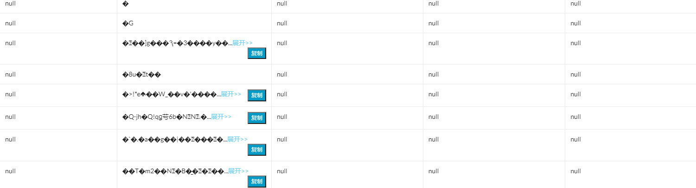

# PG 数据导入 Hive 后乱码问题调查

# 乱码问题

正在用晚餐的时候收到开发同学反馈问题如下。

数据从 PostgreSQL 中导入 Hive 中后，通过平台查询，显示乱码，并且大部分字段显示为 `null`。



# 问题原因调查

## 编码问题定位初步建议

由于数据库默认采用 UTF8 编码，如果有编码不一致问题，则会造成乱码问题。

在回到办公室前，先建议开发同学从以下方面查找问题。

**数据库连接**

如 psycopg2 中可以通过 `conn.set_client_encoding('UTF8')` 设置编码。

**查询平台**

查询 Hive 的 web 网页平台的编码，如下例子：

```
<meta http-equiv="content-type" content="text/html; charset=utf-8">
```

当然，曾被乱码问题折磨过的老司机也会想到 project 中的编码等问题。

但是这些都是在不了解开发同学具体所使用的工具、环境、平台等等的情况下作出的猜测。

## PostgreSQL 源数据调查

回到办公室后，首先确认数据库这边没有问题。

通过简单的 SELECT 语句，查询结果中文显示正常，其他列显示也均正常。然后又通过 pgadmin 查询，也是正常的。

由此确认，数据源无问题。

## 与开发同学共同调查问题

确认 PostgreSQL 源数据没有问题后，就立即去工位找开发同学。因为通过 IM 聊天效率太低了，获得的信息也太有限，反馈也不及时。

### 首先确认是不是中文问题

在 SELECT 中只保留数值的列，查看结果，仍是乱码。

### 然后确认是不是表本身的问题

通过 CTAS 方式创建测试表，并且只保留数值的列。测试后发现仍然是乱码。

### 排查 Hive SQL 

通过上述测试结果得知，确定并非 PostgreSQL 问题。然后开始和开发一起看 Hive 相关代码和 Hive SQL。

从与开发的对话中，得知，其他表是没有问题的，就这一个表有问题。那么事情就好办了，直接对比一下就可以了。

通知对比得知，原来是 Hive SQL 中少了 'stored as orc' 导致乱码。

```
create table ...
(  id bigint,
   ...
)
stored as orc;
```

# 总结

虽然上面只讲述了调查问题的三个方面，但实际中调查了更多的方向，而且测试的 case 更详尽。这里只提供下思路。

1. 出现较复杂问题，尽量面对面交流，或者语音、视频、远程桌面。简单通过 IM 聊天会效率低下。

2. 尽管不是数据库问题，也要进一下和开发一起进一步调查，而不是一句 "数据库没有问题" 就不管了。

   这样既可以帮助开发解决问题，以后遇到同样问题也可以快速指导开发定位问题。

3. 时间允许的话，平时要不断锻炼定位或 debug 问题的能力，学会从源头逐步按线索定位并解决问题，必要时再寻求帮助。