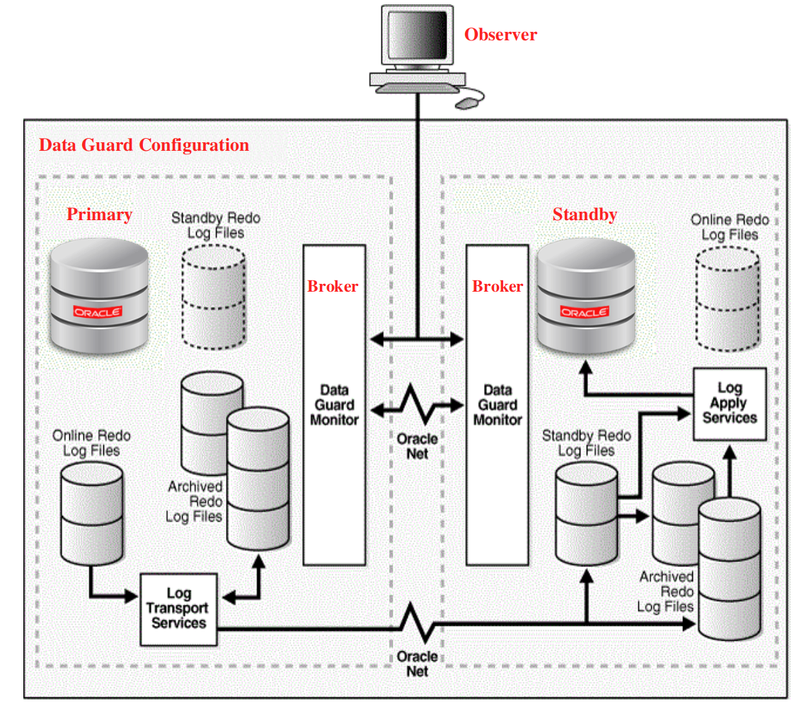
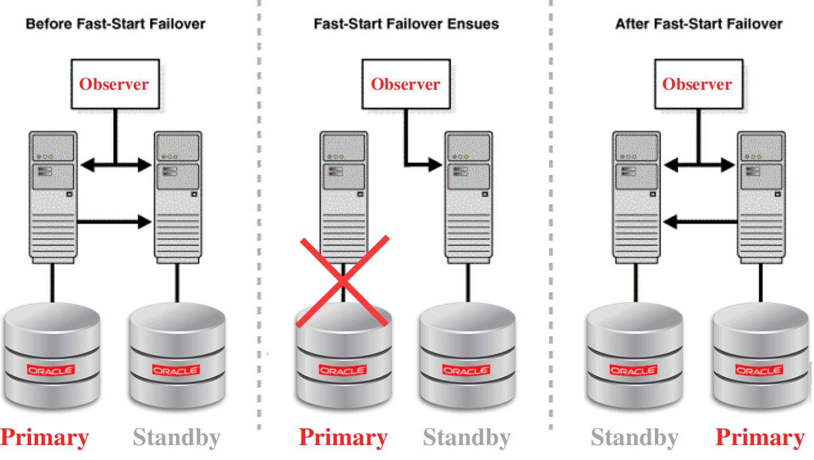
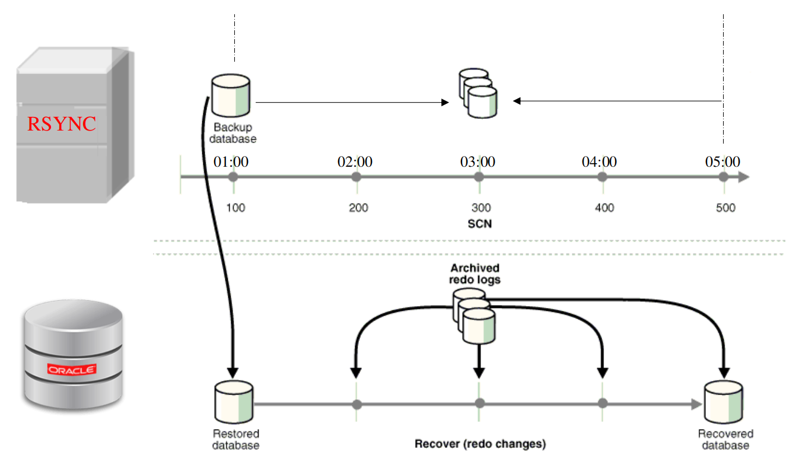
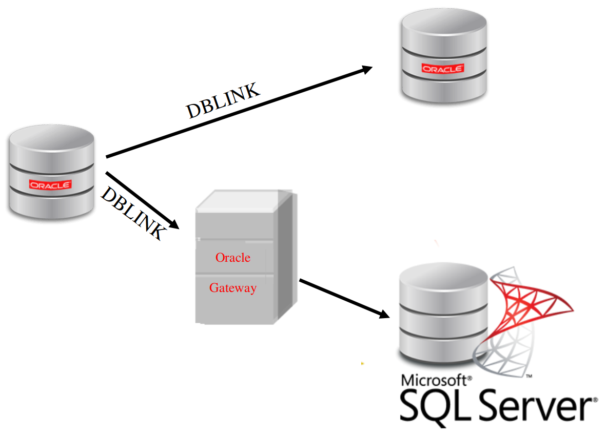

# 前言

通过此文章来分享一下 Oracle 服务器迁移过程中的一些经验，希望对大家有些许帮助。

本文旨在帮助更多的同学，会提及一些基本命令或技巧，但不赘述，后续有机会再进一步分享各个细节。

# 背景

之前因机房迁移等原因，接手过一些 Oracle 服务器，并将它们从机房 A 的机器上，迁移到机房 B 的机器上。

# 备份

经历过大灾大难的都深刻体会到其重要性。然而此处，不只备份数据库的数据。

什么? 你们已经通过 Ansible/Salt/脚本将所有配置文件管理及备份等全部自动化了？

英雄所见略同！在迁移过程中，数据库方面已经逐渐通过 Salt 实现了配置管理自动化。

## 备份 Linux 系统文件及 Oracle 配置文件

因为配置文件是静态的，可在迁移前备份一下。要知道，机房迁移完成后，再想看原来的配置，没有备份，只能悔不当初了。

### 备份 Linux 系统文件

数据库相关的 Linux 系统配置文件。

以下系统文件如果 Ops 已经通过 Ansible 或 Salt 等做了自动化管理，此步可略过。

```
/etc/hosts
/etc/sysctl.conf
/etc/security/limits.conf
```

其他可能有用的 Linux(CentOS) 系统文件

```
/etc/*release
/home/oracle/.bash_history
/root/.bash_history
/root/.bash_profile
/root/.bashrc
 
/etc/yum.repos.d/
/var/spool/cron/
/proc/version
/proc/meminfo
/proc/cpuinfo
/proc/vmstat
/proc/filesystems
/etc/issue
/etc/resolv.conf
/etc/ssh/sshd_config
/etc/ssh/ssh_config
/etc/passwd
/etc/hosts
/etc/sysctl.conf
/etc/pam.d/login
/etc/security/limits.conf
/etc/security/limits.d
/etc/selinux/config
/etc/sudoers
/etc/sudoers.d/
```

### 备份 Oracle 相关配置文件

有的系统中也用到了 Oracle Gateway，考虑它安装配置较独立且并不十分普遍，此处未列出 Oracle Gateway 相关配置文件。

```
/home/oracle/.bash_profile
/etc/oraInst.loc
/etc/oratab
$ORA_INVENTORY/orainstRoot.sh
$ORACLE_HOME/root.sh
$ORACLE_HOME/network/admin/listener.ora
$ORACLE_HOME/network/admin/tnsnames.ora
$ORACLE_HOME/dbs/init*.ora
$ORACLE_HOME/dbs/orapw*.ora
```

## 备份 Oracle 数据库

通过以下各种方式备份，有备无患。此步是在迁移完成，最后停库关机前的操作。因其也属于备份，故将其提前至此。

1. exp 备份
2. expdp 备份
3. RMAN 备份
4. 导出各个 schema 备份
5. 拷贝数据库文物理件(停数据库后)

## 历史备份迁移

将各种历史备份( exp，expdp，RMAN 备份等) 从原 rsync 服务器迁移到新的 rsync 服务器。

## 数据库相关软件备份

虽然 Oracle 官网有可下载，为避免不必要的麻烦，将安装软件也备份一下。况且以后想再找相同版本的软件，并不一定容易。

如果是按拷贝物理文件的方式迁移，后面想再通过安装的方式搭建生产或测试环境，就需要这些软件了。

注: 目前已通过 Salt 实现了 Oracle 一键安装及配置管理自动化，相关软件也放在了统一的服务器以实现配置管理自动化。

## 其他备份

如数据库服务器上各种脚本等。

# Oracle 高可用

在数据库迁移过程在有可能用到 Oracle 高可用架构，在此给出其大致结构图供参考。

## Oracle Data Guard



## Oracle Fast-Start Failover

Switchover 也类似。




# Oracle 数据库迁移方式

## 方式一 Dataguard 主从切换

能够做主从的话，此方式为最佳方式。切换时间短，对业务影响较小。

如受网络等因素影响，两个机房无法做主从，此方式将不适用。

## 方式二 通过 RMAN 备份

RMAN 备份，即全量备份，是实例级的备份。如：控制文件，数据文件，archive log 等。

RMAN 是做备份恢复的常用方式。

它可以用于如下场景：

1. 数据库迁移
2. 搭建测试环境，根据生产 RMAN 恢复出来
3. 做基于时间点（PITR）的恢复




当然，RMAN 功能远不止于此。

## 方式三 直接拷贝数据库文件

前提：相同操作系统版本，相同数据库版本等

优点：操作相对简单，除安装必要的依赖包外，只需复制文件即可

注意：额的数据库版本在拷贝数据库文件后有可能不需要额外处理，有的则可能需要作进一步处理，如执行 `clone.pl` 等命令。

### 配置文件

```
/home/oracle/.bash_profile
/etc/oratab
$ORACLE_HOME/network/admin/listener.ora
$ORACLE_HOME/network/admin/tnsnames.ora
$ORACLE_HOME/dbs/init*.ora
$ORACLE_HOME/dbs/orapw*.ora
```

### 控制文件

通过以下 SQL 查询控制文件位置

```
SELECT name FROM v$controlfile;
```

### 数据目录

```
${ORACLE_BASE}/oradata
${ORACLE_BASE}/fast_recovery_area
```

有的数据目录放在了单独的硬盘(如 SSD)上，可以通过 SQL查询数据文件位置

```
SELECT name FROM v$datafile;
```

### archive log

通过如下 SQL 查询 archive log 位置

```
ARCHIVE LOG LIST;
SHOW PARAMETER arch;
```

## 方式四 通过 exp 或 expdp 备份

跨平台的可以考虑这种方式。如从 Windows 迁移到 Linux上。

此次迁移中，一些单机的数据库采用了此种方式。

## 方式五 其他

如通过 Golden Gate 等。

# Oracle Gateway

一些系统中用到了Oracle Gateway。

如果需要从 Oracle 访问 其他类型数据库（如 SQL Server），就需要安装配置 Oracle Gateway 了。



# 定时任务

各个用户下的各个定时任务及相关脚本也需要注意迁移到新的机器。

# 配置文件

由于迁移后机器名可能有变化，所有相关的配置也需要相应修改。

# 数据传输

机房 A 到机房 B 网络是通的，但机房 B 到机房 A 网络是不通的。另外，本地网络可以访问机房 A 和机房 B 里的机器，但机房 A 里的机器不能通过 ssh 或 scp 访问机房 B 里的机器。

对于动辄几百G的数据，通过本地网络下载和上传无疑是十分低效的。

根据不同情况可以采用如下两种方法。

## 网络传输神器 - nc

相信很多大牛看到这个名字，已经露出会意的微笑。

nc 的一个优点就是，不需要用户名密码，简单易用，只要网络通即可，并且传输效率也是不错的。

以下是 nc 命令用法示例。

在接收端执行如下命令准备接收：

```
nc -l 54321| pv |tar -xvf -
```

在发送端发送文件：

```
tar -cvf - test.txt |nc test.corp.com 54321
```

## 文件同步神器 - rsync

相比 nc 命令，rsync 的以下优势，也给本次数据迁移带来了极大便利:

一，增量同步。如几百G的文件，用 nc 的话，如果中途失败，还得重头再来

二，通过 exclude-from 参数可以过虑掉大量的日志文件或目录等

rsync 还经常用于备份等，当然，rsync 命令功能及用途远不止于此。

以下是 rsync 命令用法示例。

```
rsync -aP /test/dir1 alvin@10.20.20.1::test/
rsync -aP /test/dir1 alvin@10.20.20.1::test/ --password-file=$PASSWORD_FILE --exclude-from="$EXCLUDE_FILE"
```

相信大家已经注意到上面示例中的远端路径 10.20.20.1::test。

是的，rsync 是需要在服务器端配置的，10.20.20.1::test 就是配置好的路径。

其配置也较简单，在此略过。

# 配置管理自动化

通过上述内容，大家可以看到有大量的人工操作，而且并不一定面面俱到。

如果配置管理（如通过 Ansible 或 Salt 等）做的好的话，会简单方便很多。

自动化做到极致情况下，Oracle 服务器迁移所需要做的可能仅有如下这些：

**注：目前配置管理自动化所涉及的所有脚本，配置文件等均已提交 git，所有软件都放在统一的服务器上。**

1. 准备工作
   在新机器上，跑一下 fresh install 的配置管理自动化脚本，所有的软件自动安装，用户自动创建并配置，操作系统文件等将自动配置好

2. 数据迁移
   通过以上任一合适的方式迁移数据库

3. 配置管理

   在新机器上，跑一下配置管理自动化，所有需要修改的配置及脚本、定时任务等均自动部署